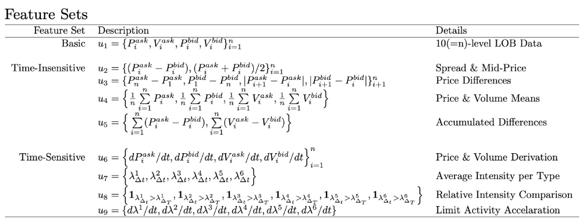
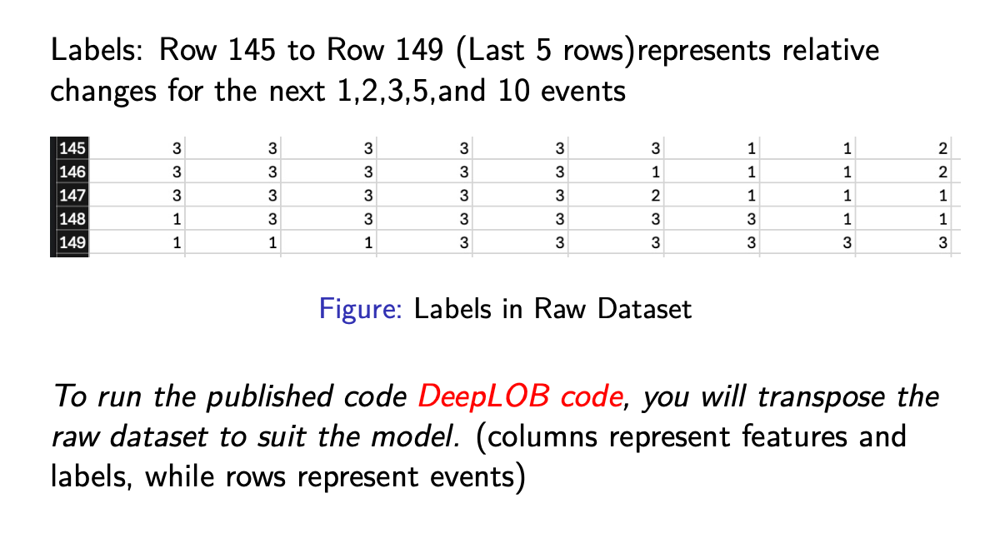

```markdown
Dear all,

Homework 2 has been posted.

In this homework, you will **replicate** the DeepLOB model from Zhang et al. (2019), and you may also **refine** the model optionally if you would like to explore further. The goal is to reproduce the main experimental setting discussed in class and evaluate the predictive performance of the model on limit order book data.

For the homework, please use the **FI-2010 dataset**, which is the benchmark high-frequency limit order book dataset used in the DeepLOB paper. We will follow **Setup 2** from the paper. According to the course slides, you should use:

- **Training data**: the first 7 days  
  Train_Dst_NoAuction_ZScore_CF_7.txt

- **Test data**: the last 3 days  
  Test_Dst_NoAuction_ZScore_CF_7.txt  
  Test_Dst_NoAuction_ZScore_CF_8.txt  
  Test_Dst_NoAuction_ZScore_CF_9.txt  

Dataset download link:  
https://etsin.fairdata.fi/dataset/73eb48d7-4dbc-4a10-a52a-da745b47a649

Reference GitHub implementation:  
[https://github.com/zcakhaa/DeepLOB-Deep-Convolutional-Neural-Networks-for-Limit-Order-Books](https://github.com/zcakhaa/DeepLOB-Deep-Convolutional-Neural-Nets-for-Limit-Order-Books)

Please also pay close attention to the data format. In the raw FI-2010 files, each column represents one event, while rows represent features and labels. The slides note that rows 1–144 contain features, and the DeepLOB model uses the top 10 levels of ask price, ask volume, bid price, and bid volume as inputs. In many public implementations, you will need to transpose the raw dataset so that rows represent events and columns represent features.

The input to the model follows the lecture discussion of DeepLOB: each sample is built from the 100 most recent LOB states, and each state contains 40 features from the top 10 bid/ask levels.

Please carefully read Lecture 4, pages 75–81, since these pages contain the dataset description, feature/label structure, label definition, and the homework requirements.

In the slide Lecture 4 pages 75-81, the content are as follows:

# Dataset

FI-2010 dataset: *the first publicly available benchmark dataset of high-frequency limit order data* and extracted time series data for five stocks from the Nasdaq Nordic stock market for a time period of 10 consecutive days

- Dataset: Download Link
- Files we need to use about Setup 2 in paper
  - Train Data: the first 7 days
    - Train_Dst_NoAuction_ZScore_CF_7.txt
  - Test Data: the last 3 days
    - Test_Dst_NoAuction_ZScore_CF_7.txt
    - Test_Dst_NoAuction_ZScore_CF_8.txt
    - Test_Dst_NoAuction_ZScore_CF_9.txt

# Dataset: Features And Labels
  Every column represents event
  Every row represents features and labels

# Dataset: Features in Raw Dataset

Features: Rows 1-144 represents different features of the top 10 level pair of LOB. (Level 1 to Level 10)

- Zhang et al. [2019] just uses Row 1 to Row 40 as features which is \( u_1 \) representing \( p_{ask}, V_{ask}, p_{bid}, V_{bid} \) from Level 1 to Level 10 in the following figure



# Dataset: Labels in Raw Dateset

Labels: Row 145 to Row 149 (Last 5 rows) represents relative changes for the next 1, 2, 3, 5, and 10 events

- Relative changes representation:  
  \[  f_j^{(i)} = \frac{1}{k} \sum_{j=i+1}^{i+k} m_j - m_i\]

- \( m \) represents mid-price of level 1 at time \( t: m_t = \frac{p_a^1(t) + p_b^1(t)}{2} \)

- \( m_j \) is the future mid-prices

- \( m_i \) is the current mid-price

- Financial data is highly stochastic. If we simply compare \( m_t \) and \( m_{t+k} \) to decide price movement, the resulting labels will be noisy

- Set a threshold for the percentage change of 0.002
  - Use label 1 if change equals to or greater than 0.002
  - Use label 2 if change varies from -0.00199 to 0.00199
  - Use label 3 if change smaller or equal to -0.002

- Notice this is the dataset labels with \( k = 1, 2, 3, 5 \) or 10.

# Dataset: Lables in Raw Dataset


Bonus tasks:
- test different prediction horizons by trying different values of \( kk \) and analyze the pattern of predictability;
- explore asset-specific vs. universal modeling.

For submission, please include a `.ipynb` notebook, similar to what you submitted for Homework 1. Your notebook should clearly describe the data files used, preprocessing steps, model settings, evaluation metrics, and a comparison between your results and those reported in the paper.

Best,
```